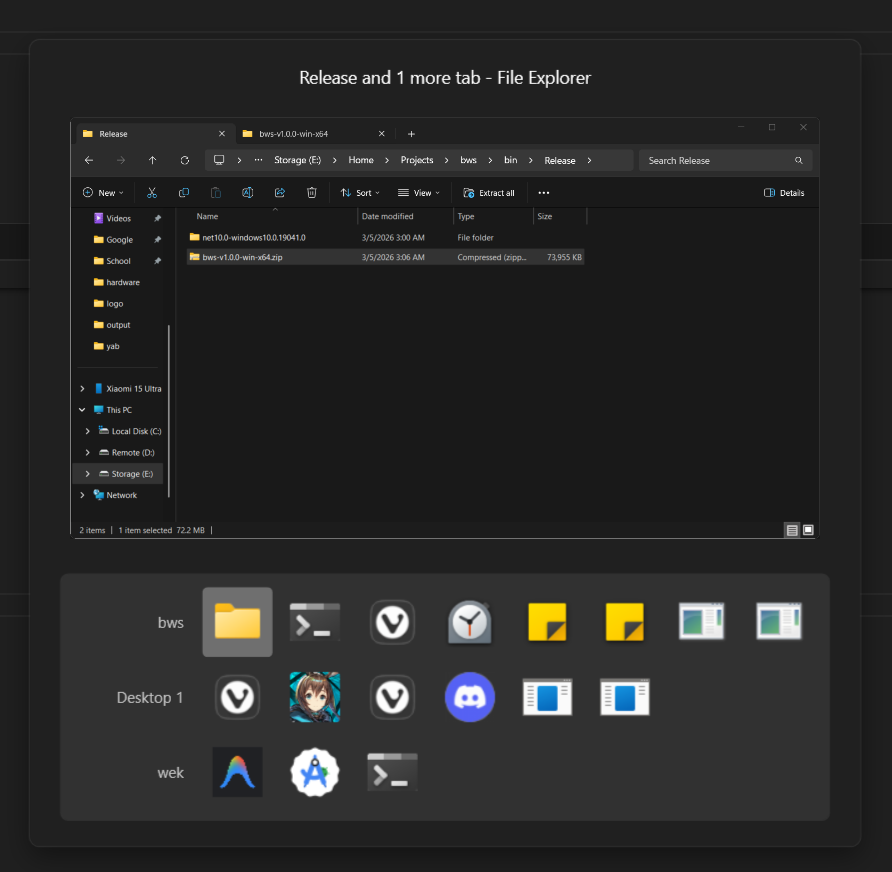

> [!CAUTION]
> This is a project where I basically let Antigravity wing it to create some utilities I needed. Fair warning: the project is likely a chaotic, disjointed mess
> Feel free to open an Issue if something's broken. I might let Antigravity patch it if the mood strikes. Or just fork it and do it yourself.

> [!CAUTION]
> **Warning: Experimental & Fragile**  
> This project heavily relies on `IVirtualDesktopManagerInternal`, a **private and undocumented** Windows COM API. Microsoft can and will change this interface in any Windows update, which **will break this application** without notice.
>
> **Confirmed Working Environment:**  
> - **Windows 11 25H2 (OS Build 26200.8037)**
> 
> Operation on any other builds or versions is **untested and not guaranteed**. Use at your own risk.

<p align="center">
  
</p>

<h1 align="center">bws - Better Window Switcher</h1>

<p align="center">
  A high-performance, <code>AltTab</code> replacement for Windows.<br/>
  Built with .NET 10 &amp; WPF. Designed for power users.
</p>

<p align="center">
  
  
  
</p>

---

## ✨ Features

| Feature | Description |
|---|---|
| **Window-Based Switching** | Shows individual windows, not grouped by app. Two Chrome windows → two icons. |
| **DWM Live Thumbnail** | Zero-lag live preview via `DwmRegisterThumbnail` — no screenshots. |
| **Virtual Desktop Aware** | Full support for Windows 11 25H2. Groups windows by workspace with MRU-ordered desktop rows. |
| **Vim-Style Navigation** | `H/J/K/L`, `A/S/D/W`, arrow keys, or `Tab`/`Shift+Tab` to navigate. |
| **Quick Actions** | `Q` to close a window ・ `Enter`/`Space` to switch ・ `Esc` to cancel. |
| **Blacklist** | Filter out noisy background processes via `blacklist.txt`. |
| **System Tray** | Runs silently in the tray. Right-click for options. |

---

## 🛠️ Operating System Compatibility

`bws` is deep-integrated with Windows 11's private COM APIs to ensure seamless workspace switching.

**Only confirmed to work with Version 25H2 (OS Build 26200.8037).**

We use `IVirtualDesktopManagerInternal` to handle desktop enumeration and switching, which allows us to bypass the usual API limitations and provide a much faster experience than standard switchers.

---

## ⌨️ Keyboard Shortcuts

### Activation

| Shortcut | Action |
|---|---|
| `Alt + Tab` | Open switcher (release `Alt` to switch) |
| `Alt + Shift + Tab` | Open switcher, move backward |
| `Ctrl + Alt + Tab` | Open switcher in **sticky mode** (stays open) |

### Navigation (while switcher is open)

| Shortcut | Action |
|---|---|
| `Tab` / `D` / `L` / `→` | Move right |
| `Shift+Tab` / `A` / `H` / `←` | Move left |
| `` ` `` / `S` / `J` / `↓` | Move down (next desktop row) |
| `` Shift+` `` / `W` / `K` / `↑` | Move up (previous desktop row) |
| `Enter` / `Space` / `LMB` | Switch to selected or clicked window |
| `Q` / `MMB` | Close the selected or clicked window |
| `Esc` | Cancel and hide |


---


## ⚙️ Configuration

### Blacklist

Edit `blacklist.txt` (next to the exe) to exclude processes from appearing in the switcher:

```
# One process name per line
TextInputHost.exe
PhoneExperienceHost.exe
```


## 🤝 Contributing

Pull requests are welcome! Feel free to submit issues for bugs or feature requests.

---

## 📄 License

MIT License — see [LICENSE](LICENSE) for details.
